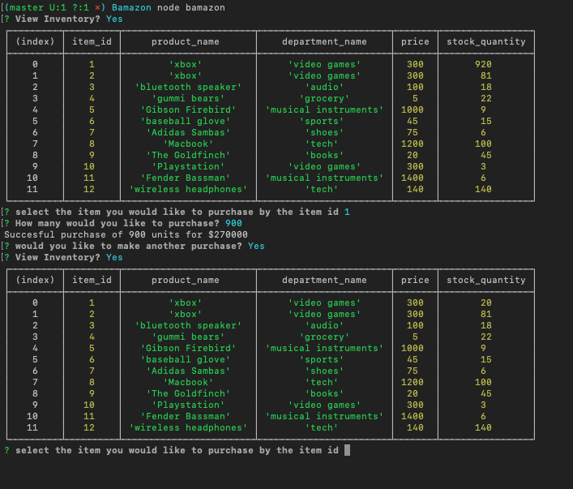
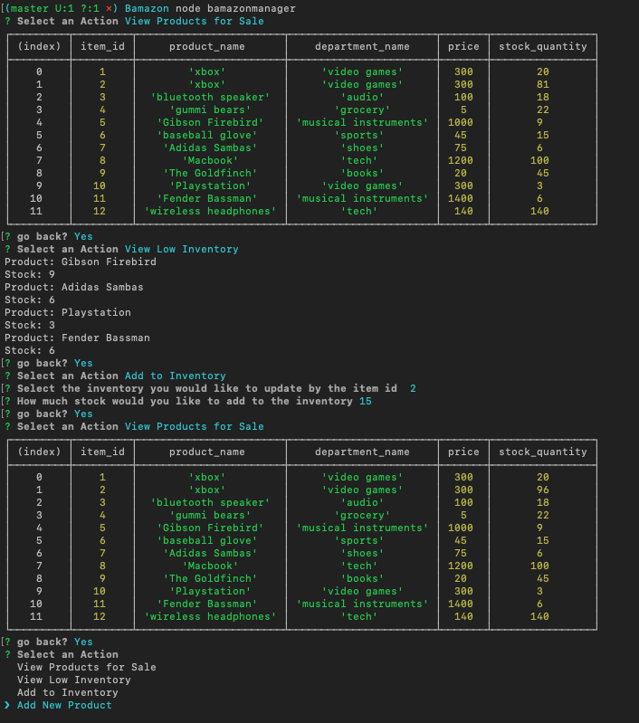

# Bamazon
Bamazon is an CLI Amazon like storefront that tracks products and inventory with customer and manager terminals.

# Customer View
Bamazon Customer shows a list of available products and prompts the user to select the product they wish to purchase by inputing an item id.  

The inventory is updated accordingly and displays the user the total spent.  

# Manager View
The manager shows a list of available products as well as a choice to view which products have a low inventory (less than 10 units).

If an item's inventory is low there is an option to add more stock to the item's inventory.  The user can also add a brand new item into the database. 

## Technologies Used
- MySql 
- node.js 
- javascript 
